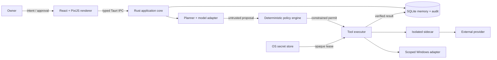
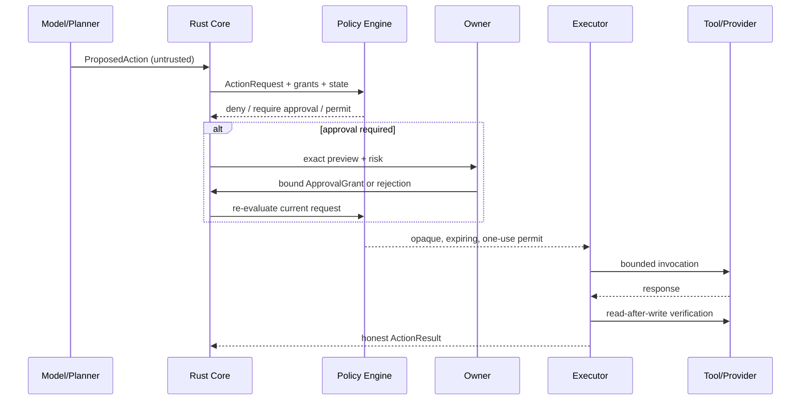
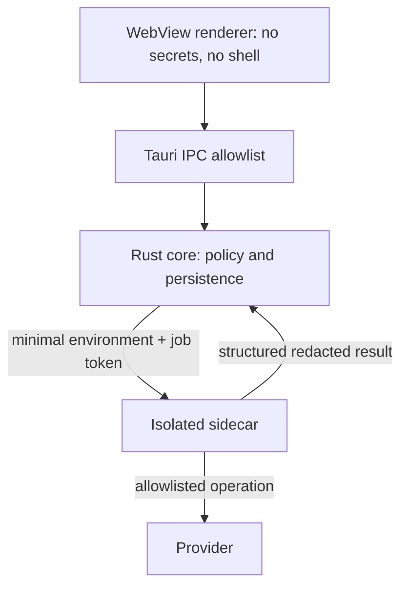

# Architecture diagrams

Boundary-level diagrams are normative; changes require an ADR.

## Components and trust zones

```mermaid
flowchart LR
 Owner[Owner] -->|intent / approval| UI[React + PixiJS renderer]
 UI -->|typed Tauri IPC| Core[Rust application core]
 Core --> Planner[Planner + model adapter]
 Planner -->|untrusted proposal| Policy[Deterministic policy engine]
 Core --> Memory[(SQLite memory + audit)]
 Policy -->|constrained permit| Exec[Tool executor]
 Exec --> Sidecar[Isolated sidecar]
 Exec --> Native[Scoped Windows adapter]
 Sidecar --> Provider[External provider]
 Secrets[OS secret store] -->|opaque lease| Exec
 Exec -->|verified result| Memory
```

## Side-effect protocol

```mermaid
sequenceDiagram
 participant M as Model/Planner
 participant C as Rust Core
 participant P as Policy Engine
 participant O as Owner
 participant E as Executor
 participant T as Tool/Provider
 M->>C: ProposedAction (untrusted)
 C->>P: ActionRequest + grants + state
 P-->>C: deny / require approval / permit
 alt approval required
   C->>O: exact preview + risk
   O->>C: bound ApprovalGrant or rejection
   C->>P: re-evaluate current request
 end
 P-->>E: opaque, expiring, one-use permit
 E->>T: bounded invocation
 T-->>E: response
 E->>T: read-after-write verification
 E-->>C: honest ActionResult
```

## Process boundary

```mermaid
flowchart TB
 Renderer[WebView renderer: no secrets, no shell] --> IPC[Tauri IPC allowlist]
 IPC --> Rust[Rust core: policy and persistence]
 Rust -->|minimal environment + job token| Child[Isolated sidecar]
 Child -->|allowlisted operation| Remote[Provider]
 Child -->|structured redacted result| Rust
```
